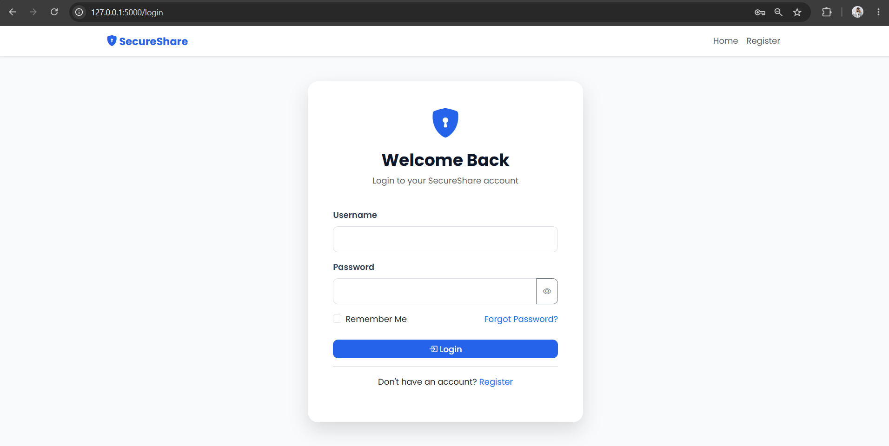
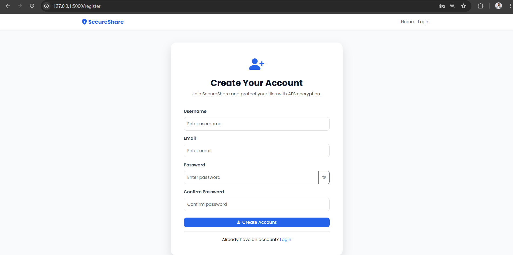
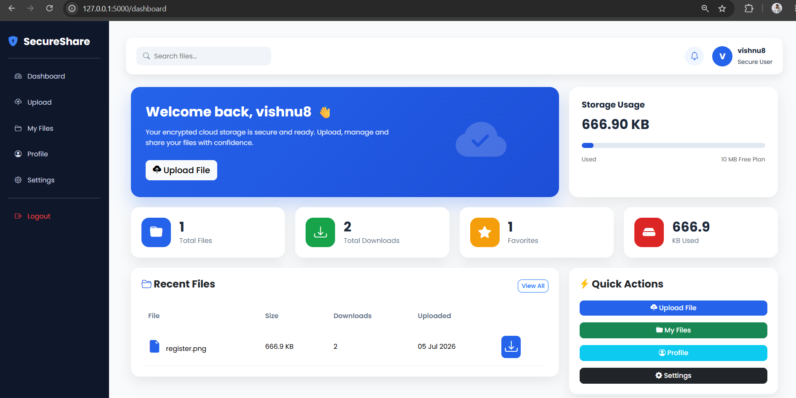
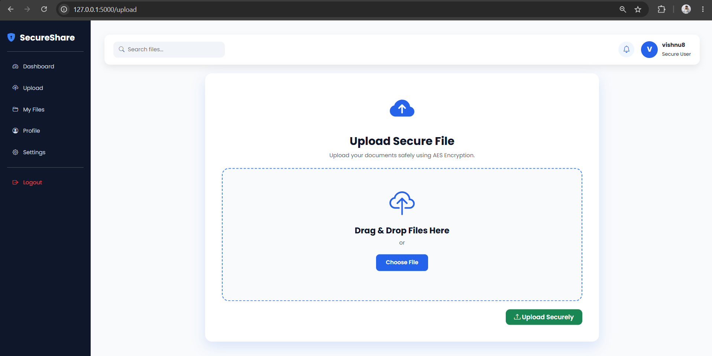
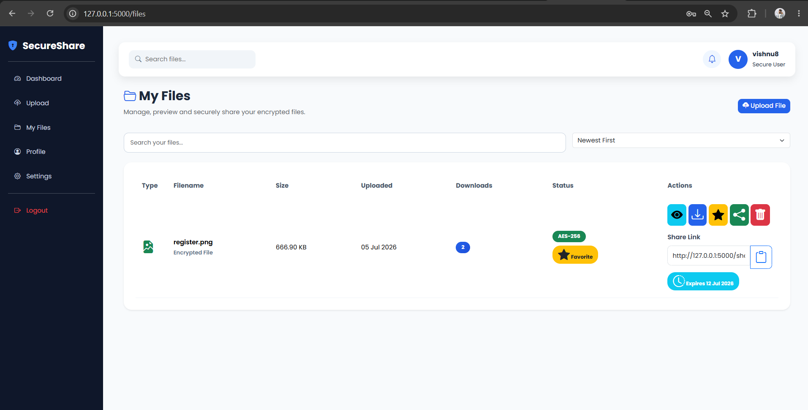
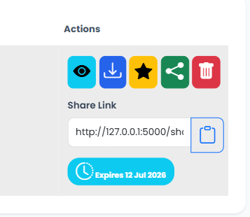
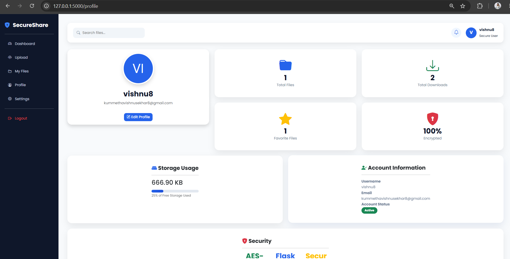
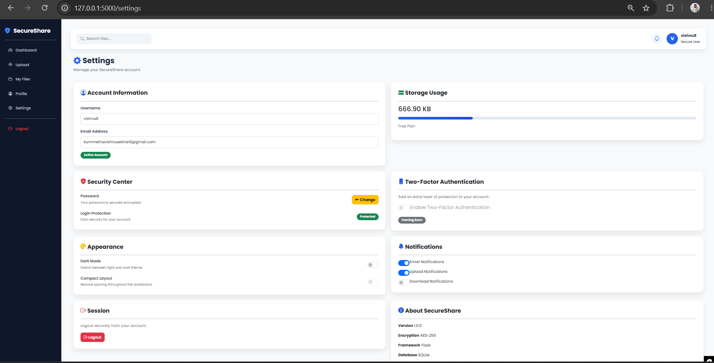

# 🔐 SecureShare – Secure File Sharing Platform


> A cybersecurity-focused secure file sharing platform built with **Python (Flask)** that enables encrypted file storage, secure sharing, password-protected downloads, expiring links, and access-controlled file management.

---

# 📖 Overview

SecureShare is a secure cloud-based file sharing platform designed to demonstrate practical cybersecurity concepts. The application provides authenticated users with a safe environment to upload, encrypt, manage, preview, and share files while ensuring confidentiality and controlled access.

The project focuses on implementing secure file management using modern web technologies and encryption techniques.

---

# 🎯 Project Objective

Develop a secure file sharing platform implementing modern cybersecurity concepts, including:

- Secure user authentication
- AES file encryption
- Access control
- Secure file sharing
- Password-protected downloads
- Expiring share links
- Responsive user interface

---

# 🚀 Project Status

**Current Version:** **v1.0.0**

✅ Stable Release

This project is under active development and will continue to receive security and feature enhancements.

---

# ✨ Features

| Feature | Status |
|---------|:------:|
| User Registration | ✅ |
| User Login | ✅ |
| Secure Authentication | ✅ |
| AES File Encryption | ✅ |
| File Upload | ✅ |
| File Download | ✅ |
| File Preview | ✅ |
| Secure Share Links | ✅ |
| Password Protected Sharing | ✅ |
| Expiring Share Links | ✅ |
| Favorite Files | ✅ |
| Search Files | ✅ |
| File Sorting | ✅ |
| Dashboard | ✅ |
| User Profile | ✅ |
| Settings Page | ✅ |
| Responsive UI | ✅ |
| Activity Log | 🚧 Planned |
| Admin Dashboard | 🚧 Planned |
| Multiple File Upload | 🚧 Planned |

---

# 🛡 Security Features

- 🔐 AES File Encryption
- 👤 Secure User Authentication
- 🔑 Password-Protected Share Links
- ⏳ Expiring Download Links
- 📂 User File Ownership Verification
- 🔒 Session-Based Access Control
- 🛡 Secure File Preview
- 🚫 Unauthorized Access Prevention

---

# 🖥 Technology Stack

## Backend

- Python
- Flask
- Flask-Login
- SQLAlchemy

## Frontend

- HTML5
- CSS3
- Bootstrap 5
- JavaScript
- Bootstrap Icons

## Database

- SQLite

## Security

- AES Encryption
- Secure Authentication
- Access Control
- Password-Protected Sharing

---

# 📂 Project Structure

```text
SecureShare-Cybersecurity-Project/
│
├── app.py
├── auth.py
├── config.py
├── encryption.py
├── models.py
├── routes.py
├── requirements.txt
├── README.md
│
├── static/
│   ├── css/
│   ├── js/
│   ├── images/
│   └── icons/
│
├── templates/
│   ├── auth/
│   ├── components/
│   ├── dashboard.html
│   ├── files.html
│   ├── upload.html
│   ├── profile.html
│   ├── settings.html
│   └── shared_download.html
│
├── uploads/
├── encrypted_files/
└── database/
```

---

# 🔄 Application Workflow

```text
User

      │

      ▼

Login / Register

      │

      ▼

Dashboard

      │

      ▼

Upload File

      │

      ▼

AES Encryption

      │

      ▼

Encrypted Storage

      │

      ▼

Secure Download / Preview

      │

      ▼

Share File

      │

      ▼

Password + Expiry Protected Link
```

---

# 📸 Screenshots

## Login Page



---

## Register Page



---

## Dashboard



---

## Upload File



---

## My Files



---

## File Preview



---

## Profile



---

## Settings



---

# ⚙ Installation

Clone the repository:

```bash
git clone https://github.com/kummethavishnusekhar8-eng/SecureShare-Cybersecurity-Project.git
```

Go to the project folder:

```bash
cd SecureShare-Cybersecurity-Project
```

Create a virtual environment:

```bash
python -m venv venv
```

Activate the virtual environment

### Windows

```bash
venv\Scripts\activate
```

### Linux / macOS

```bash
source venv/bin/activate
```

Install dependencies:

```bash
pip install -r requirements.txt
```

Run the application:

```bash
python app.py
```

Open your browser:

```
http://127.0.0.1:5000
```

---

# 🚀 Roadmap

Completed

- ✅ Authentication
- ✅ Dashboard
- ✅ AES Encryption
- ✅ Upload & Download
- ✅ Secure Sharing
- ✅ Password Protected Links
- ✅ Expiring Links
- ✅ File Preview
- ✅ User Profile
- ✅ Settings

Upcoming

- 🚧 Activity Log
- 🚧 Admin Dashboard
- 🚧 Storage Analytics
- 🚧 Multiple File Upload
- 🚧 Email Sharing
- 🚧 Two-Factor Authentication (2FA)
- 🚧 RSA + AES Hybrid Encryption
- 🚧 Cloud Storage Integration

---

# 💡 Skills Demonstrated

- Python Development
- Flask Framework
- SQLAlchemy ORM
- Authentication & Authorization
- AES Encryption
- Secure File Handling
- Access Control
- Bootstrap UI Development
- Responsive Web Design
- SQLite Database Management
- Cybersecurity Fundamentals

---

# 📌 Version History

## v1.0.0

Initial Stable Release

### Implemented

- User Authentication
- Dashboard
- AES Encryption
- File Upload
- File Download
- Secure File Sharing
- Password-Protected Links
- Expiring Links
- File Preview
- Favorites
- Search & Sorting
- Profile Page
- Settings Page

---

# 🤝 Contributing

Contributions, ideas, bug reports, and feature requests are welcome.

If you'd like to improve SecureShare:

1. Fork the repository
2. Create a feature branch
3. Commit your changes
4. Submit a Pull Request

---

# 📄 License

This project is licensed under the **MIT License**.

---

# 👨‍💻 Author

**Kummetha Vishnu Sekhar Reddy**

Cybersecurity Enthusiast | Python Developer

GitHub:
https://github.com/kummethavishnusekhar8-eng

---

⭐ If you found this project useful, consider giving it a star on GitHub!